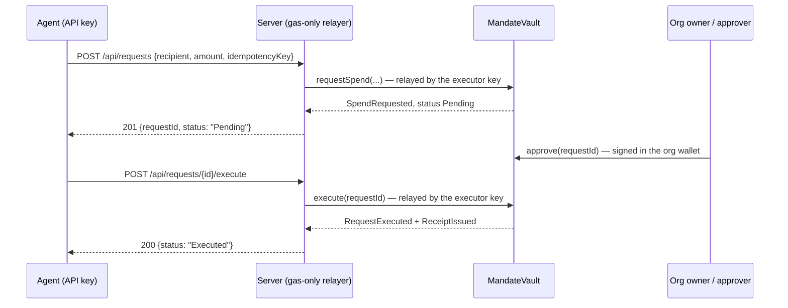

<div align="center">

# Mandate

**Agent Spending Control Plane on BOT Chain**

Policy-checked spend vaults for autonomous agents. Anyone gets their own vault in minutes: pick a
leash, fund it with tUSDT, and hand any AI agent a scoped API key.
The agent holds nothing - a funded vault enforces caps, allowlists, daily limits, approval
thresholds and dedup on-chain, and every spend needs a human approval unless policy says otherwise.

[Architecture](./architecture.md) · [Security](./security.md) · [Adversarial Testing](./adversarialtesting.md)

`BOT Chain Bohr testnet 968` · `Solidity` · `Foundry` · `Next.js` · `viem` · `MIT`

</div>

---

## The idea

Autonomous agents need to move money to act - pay a vendor, settle a task, buy compute.
Hand one an unrestricted key and a single prompt injection, hallucinated action, or runaway loop can
drain it.

Mandate gives the agent a key that **holds nothing** and can only ever move value **inside policy**.
The product is self-serve:

1. **Create your vault.** One signature deploys a vault owned by *your* wallet (via
   `MandateVaultFactory`, one vault per wallet). It is pre-configured with the leash you chose -
   max per transaction, daily cap, expiry, approval threshold - and the owner is pre-registered as
   the first agent so a treasury is usable immediately.
2. **Fund it.** Deposit tUSDT into the vault. The agent can only spend what is in the vault - it
   never holds a balance itself.
3. **Hand your agent a key.** Register the agent address, set its policy, allowlist the tokens and
   recipients it may pay, then issue a one-time API key. Any AI agent (opencode, Claude, ChatGPT)
   introspects its leash through `GET /api/agents/me` and proposes spends inside it.

Every spend follows the same three-step path, and the **contract is the only authority**:



The server cannot approve anything, change policy, or move value on its own authority.
It holds a gas-only key and may relay exactly two calls: `requestSpend` and `execute`.
Both are re-validated on-chain, and `execute` still requires the request to be approved first.

## Live on BOT Chain Bohr testnet (chain 968)

RPC `https://rpc.bohr.life` · Explorer `https://scan.bohr.life`

| Contract | Address |
|----------|---------|
| **`MandateVaultFactory`** | [`0xcc9eAfFA4AB9108eB4E66952c420630D6340A719`](https://scan.bohr.life/address/0xcc9eAfFA4AB9108eB4E66952c420630D6340A719) |
| **`MandateVault`** | [`0x45672a2cC6dfA5b975A6DBC5638C0154c01C85Be`](https://scan.bohr.life/address/0x45672a2cC6dfA5b975A6DBC5638C0154c01C85Be) |
| **Owner / bootstrap executor** | [`0x3F5b96A494061F7338Da529e3047809Ac6a7FB84`](https://scan.bohr.life/address/0x3F5b96A494061F7338Da529e3047809Ac6a7FB84) |
| **tUSDT (6 decimals)** | [`0x75edC9335175Fc0552D51D48439F229c10420fe3`](https://scan.bohr.life/address/0x75edC9335175Fc0552D51D48439F229c10420fe3) |

The testnet deployment uses one EOA as both owner and executor, which is convenient for a demo but
**not** the production shape - see [Security](./security.md).

### Proven on-chain artifacts

A full agent lifecycle, with a separate agent address and an owner-signed approval:

- **Request** (`requestSpend`, status `Pending`): tx
  [`0xd5e65dfe…`](https://scan.bohr.life/tx/0xd5e65dfe63ea2fb3de758fdf81636ce52faa7d7186eba359344624fd3ae0ff5b)
- **Owner approval** (`approve`, threshold reached): same request id
  `0x33b66135e22dedce371a780923528be083c98516d73b84d4673cf209bd86c585`
- **Settlement** (`execute`, `RequestExecuted` + `ReceiptIssued`): tx
  [`0xd76b5c7b…`](https://scan.bohr.life/tx/0xd76b5c7bb9d1cb3a13dd00db26248c292f76606c45ed1be87bfefb643679d38a)

Balances moved exactly as expected: vault `-1,000,000` base units, recipient `+1,000,000`.
Attempting to execute before approval reverts `RequestNotApproved`; a second execute reverts
`RequestFinalized`.

## Repository layout

```
src/                      Solidity - MandateVault.sol, MandateVaultFactory.sol, MockUSD.sol
test/                     Foundry suite (83 tests: unit + fuzz + authorization)
script/                   deploy scripts (DeployMandateFactory, DeployMandateVault)
web/                      Next.js app (marketing + dashboard + API routes)
lib/                      vendored deps (OpenZeppelin, forge-std)
architecture.md           components, authority model, spend lifecycle
security.md               guarantees, threat model, key management
adversarialtesting.md     how each control is verified
```

## Quick start

```bash
# Contracts - build + test
forge build
forge test

# Frontend - marketing + dashboard + API
cd web && npm install && npm run dev   # http://localhost:3000
```

Copy `web/.env.example` to `web/.env.local` and fill in the BOT RPC, factory and vault addresses,
the Privy app ID, and `EXECUTOR_PRIVATE_KEY` (the gas-only relayer key).
The dashboard reads live chain state without any secret configured; write controls require the
organization wallet connected through Privy.

```bash
# Live API QA - run the real request/auth/policy suite against a running server
cd web && node scripts/qa-agent.mjs --api-key mdt_...
```

## Documentation

- **[architecture.md](./architecture.md)** - components, authority model, spend lifecycle.
- **[security.md](./security.md)** - guarantees, threat model, and key management.
- **[adversarialtesting.md](./adversarialtesting.md)** - unit, fuzz, and live on-chain acceptance.

## License

[MIT](./LICENSE).