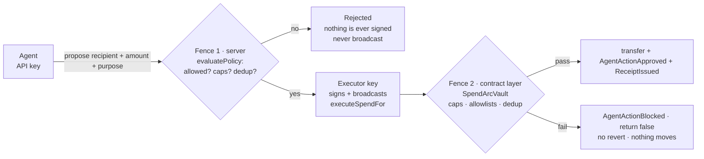
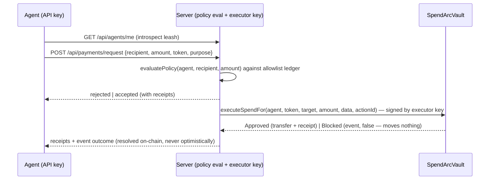

# Architecture

[← README](./README.md) · [Security](./security.md) · [Adversarial Testing](./adversarialtesting.md)

SpendArc fences an autonomous agent with **two independent controls** — one at the server layer
(policy evaluation before anything is signed), one at the contract layer (the vault re-checks every
spend on-chain). Neither substitutes the other.

---

## The two fences



- **Fence 1 (server)** decides *whether the request is worth signing*. It gates **policy**: the
  executor's private key only ever signs a call to `SpendArcVault.executeSpendFor` after the server has
  checked the agent's allowlist and budget against its own ledger. Off-policy → rejected → no signature
  → never broadcast.
- **Fence 2 (the vault)** decides *whether value moves*. It gates **policy** on-chain and moves value
  only inside it. A blocked action **emits an event and returns `false`** rather than reverting, so every
  decision is a permanent on-chain artifact.

**The seam:** the server does *not* pre-check raw vault state. The vault independently re-reads the
policy, service allowlist, caps, and `actionId` dedup at execution time, so a stale or inconsistent
server ledger cannot move value off-policy.

## Components

| Component | Role |
|-----------|------|
| **`SpendArcVault.sol`** | Fence 2. Holds the owner's USDC, enforces per-agent policy (active/expiry, token + per-service allowlists, per-tx + rolling-24h daily caps, actionId dedup). ERC20-first (`SafeERC20`) + native path. No-revert-on-policy; hand-rolled reentrancy guard; checks-effects-interactions. |
| **`SpendArcVaultFactory.sol`** | Deploys one isolated vault per wallet, so each user funds and owns its own. Pre-authorizes the platform executor (spend-within-policy only) and pre-registers the owner as the vault's single agent (`label: "self"`). |
| **Server executor** (`web/lib/executor.ts` + `/api/...` routes) | Fence 1. Holds the `EXECUTOR_PRIVATE_KEY`, evaluates policy server-side, then signs/broadcasts `executeSpendFor`. The executor can spend only inside an agent's policy — it can never change policy, deposit, or withdraw. |
| **Agent** | The owner's API key / wallet address (the vault's `agent` key in policy). It only *proposes* spends; it never holds or moves funds itself. |
| **`MockUSD.sol`** | 6-decimal test stablecoin (used as the USDC stand-in in tests only; not deployed to the live network). |

## On-chain allowlist (per service, not just per address)

Allowlisting is no longer a binary true/false per target. Each entry is a small policy of its own:

```
struct ServiceAllowlist {
    bool     allowed;      // whether the target can be paid at all
    string   label;        // human name ("self", "Sim Analytics API", ...)
    uint128  maxPerTx;     // 0 = no per-service per-tx limit (global leash still applies)
    uint128  dailyCap;     // 0 = no per-service daily limit (global leash still applies)
    uint128  spentToday;
    uint64   lastResetTime;
    uint64   expiry;
}
```

`setAllowedService(agent, target, label, maxPerTx, dailyCap, expiry, allowed)` replaces the old binary
`setAllowedTarget`-style flag. Caps are validated (`dailyCap == 0 || maxPerTx <= dailyCap`). The per-service daily
budget rolls over on its own 24h window (`lastResetTime + DAY`), independently of the agent's global
leash. A service entry with `maxPerTx = 0, dailyCap = 0` still passes the service layer and is bounded by
the global policy caps backstop. The owner's own wallet is pre-seeded as `label: "self"`.

## Address model

```
wallet owner EOA  ──funds+owns──▶  SpendArcVault (their vault)
     │                                    │
   owns vault                          msg.sender: owner or authorized executor
   pre-registered as agent            executeSpendFor → _executeSpend(agent, ...)
```

Policy and allowlists are keyed on the **agent address** throughout, so multi-agent is a config change,
not a refactor. For a factory vault, owner == agent (the owner's wallet is its own agent). The executor is
a **separate** role: spend-within-policy only.

## Spend lifecycle (the proven sequence)



Fence 1 (server) and Fence 2 (vault) are **independent**: the vault does not trust the server's ledger,
and the executor never signs for an off-policy request. `actionId` dedup is enforced on-chain, so the
server's retry/resume logic cannot double-spend.

## Replay & idempotency

| Layer | Guards | Mechanism |
|-------|--------|-----------|
| **Vault `actionId`** | spend replay | `usedAction[actionId]` dedup, on-chain |
| **Server ledger** | policy state | allowlist entries + budget rows in the DB, reconciled against on-chain state on sync |

## EVM & tooling

- `evm_version = cancun`; solc 0.8.28.
- Deps: OpenZeppelin 5.x, forge-std.
- No ERC-4337: no EntryPoint, no paymaster, no bundler, no user ops. The executor key signs and
  broadcasts a plain contract call.

See **[adversarialtesting.md](./adversarialtesting.md)** for how each of these is verified, and
**[security.md](./security.md)** for the guarantees they provide.