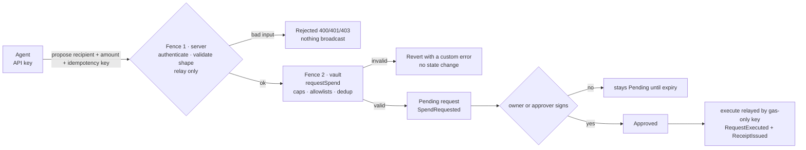
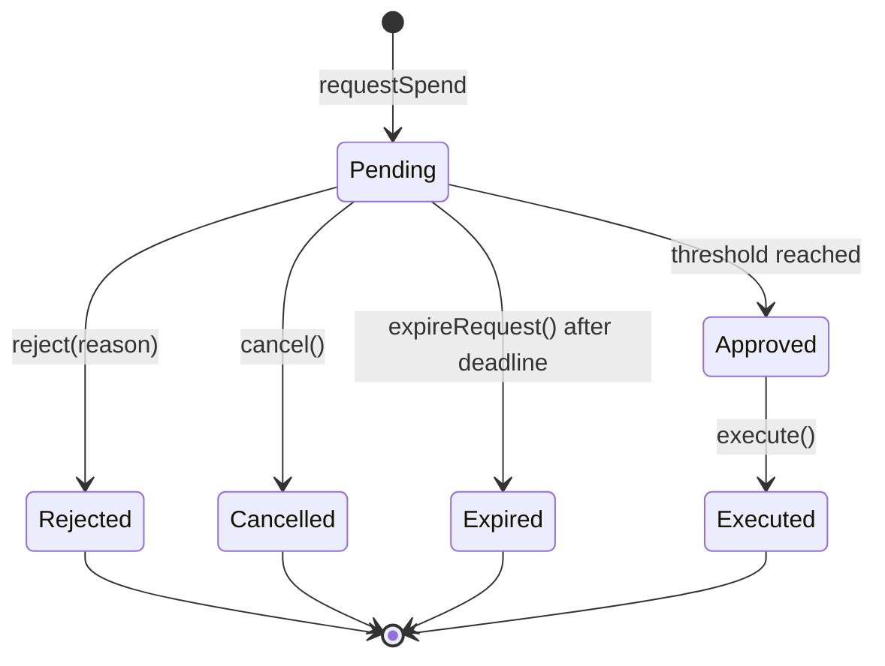

# Architecture

[← README](./README.md) · [Security](./security.md) · [Adversarial Testing](./adversarialtesting.md)

Mandate fences an autonomous agent with **two independent controls** — one in the server, which
decides what is worth relaying, and one in the vault, which decides whether value moves at all.
Neither substitutes for the other, and the vault holds the only state that counts.

---

## The two fences



- **Fence 1 (server)** decides *whether a call is worth signing*. It authenticates the bearer key,
  validates request shape, and can only ever relay `requestSpend` and `execute`. It cannot approve,
  cannot change policy, and cannot withdraw.
- **Fence 2 (the vault)** decides *whether value moves*. It re-reads the policy, allowlists, caps,
  approval state and idempotency key at execution time, then transfers. Anything off-policy reverts
  with a named custom error and moves nothing.

**The seam:** the server holds no policy mirror. Every number the UI shows is read from the vault.
A stale server can at worst fail to relay; it cannot authorize.

## Components

| Component | Role |
|-----------|------|
| **`MandateVault.sol`** | The ledger and authorization boundary. Holds owner funds, enforces per-agent policy (active, expiry, token + per-service allowlists, per-tx cap, rolling daily cap), approval thresholds, and idempotent request creation. `SafeERC20`, hand-rolled reentrancy guard, checks-effects-interactions. |
| **`MandateVaultFactory.sol`** | Deploys one isolated vault per owner wallet. The executor is immutable and set at deploy time; the owner becomes the vault's first agent. |
| **Server relayer** (`web/lib/relayer.ts`) | Fence 1. Holds `EXECUTOR_PRIVATE_KEY` and submits only `requestSpend` and `execute`. Confirms the key is still registered on-chain before relaying, so a revoked executor fails at the server instead of burning gas. |
| **Credential store** (`web/lib/agents.ts`) | libSQL. Stores only `sha256` hashes of agent API keys, plus owner-signed authorization nonces. There is no code path that can read a stored key back. |
| **Agent** | An address registered in the vault, holding a scoped API key. It proposes spends; it never holds funds. |
| **`MockUSD.sol`** | 6-decimal test stablecoin for the Foundry suite only. Not deployed to the live network. |

## Authority model

| Capability | Who can do it | Enforced by |
|------------|---------------|--------------|
| `requestSpend` | registered agent, owner, approver, or executor | `agents[msg.sender] \|\| msg.sender == owner \|\| approvers[msg.sender] \|\| executors[msg.sender]` |
| `approve` / `reject` | owner or a registered approver | `onlyOwner \|\| approvers[msg.sender]` |
| `cancel` | owner, the requesting agent, or an approver | same, keyed on the stored agent |
| `execute` | owner, executor, or the agent itself | `_requireCanExecute` |
| `setAgentPolicy`, `setAllowedService`, `setAllowedToken`, `setAgent`, `setApprover`, `setExecutor`, `setPaused`, `withdrawToken` | owner only | `onlyOwner` |
| Factory executor / deployer | immutable | constructor |

`approvalThreshold == 0` means auto-approve on request; `requestAndExecute` is only callable in that
mode and reverts `InvalidApproval` for any agent that requires sign-off, so auto-execution cannot be
smuggled past a human gate.

### Address model

```
org wallet / multisig  ──owns──▶  MandateVault
     │                            │
  policy + approvals        agent, approver, executor mappings
  (onlyOwner)                    │
                                ▼
                    gas-only executor key  ──relays──▶  requestSpend / execute
```

Policy and allowlists are keyed on the **agent address**, so multi-agent is configuration, not a
refactor. The executor is a **distinct role**: relay-only, spend-within-policy-only.

## Per-service budgets

Allowlisting is a policy, not a boolean:

```
struct ServicePolicy {
    bool     allowed;      // may this target be paid at all?
    string   label;        // human name ("infra", "vendor-x", ...)
    uint128  maxPerTx;     // 0 = no per-service cap (global leash still applies)
    uint128  dailyCap;     // 0 = no per-service cap (global leash still applies)
    uint128  spentToday;
    uint64   lastResetTime;
    uint64   expiry;
}
```

`setAllowedService(agent, target, label, maxPerTx, dailyCap, expiry, allowed)` validates
`dailyCap == 0 || maxPerTx <= dailyCap`. The per-service daily window rolls independently of the
agent's global cap, so one expensive vendor cannot consume the whole leash. A service entry with
`maxPerTx = 0, dailyCap = 0` still passes the service layer and is bounded by the global caps.

## Request lifecycle



Terminal states are final: a second `execute` reverts `RequestFinalized`, and `reject` on a settled
request reverts `RequestNotPending`.

### Idempotency

`requestId = computeRequestId(idempotencyKey)`.

- The same key with the same parameters returns the same request - a retry is safe.
- The same key with **different** parameters reverts `IdempotencyConflict`, so a client cannot reuse
  a key to smuggle in a new amount.
- Once a request is terminal, the same key keeps returning that terminal request. A retry that is
  meant to be reconsidered must use a fresh key.

## API surface

| Route | Auth | Purpose |
|-------|------|---------|
| `GET /api/health` | none | Liveness, deployed vault/factory, relayer configured |
| `GET /api/agents/me` | agent bearer | Live agent projection: on-chain policy, balances, remaining cap |
| `POST /api/requests` | agent bearer | Relay `requestSpend` for the authenticated agent |
| `GET /api/requests/{id}` | agent bearer | Agent-scoped request read |
| `POST /api/requests/{id}/execute` | agent bearer | Relay `execute`; reverts if not approved |
| `POST /api/agents/credentials` | owner signature | Issue, rotate, or revoke an agent API key |

The agent address always comes from the authenticated credential, never from the request body.
Credential mutations require an EIP-191 signature from the live on-chain vault owner over a canonical
payload binding action, agent id, agent address, chain, vault, timestamp and nonce.
The server verifies the signature, confirms the agent is registered on-chain, and burns the nonce so
a captured signature cannot be replayed.

## Read path

`web/lib/reads.ts` reads the vault directly: policy, service budgets, remaining caps, and event
history.
History is bounded to a 200,000-block default window, fetches block timestamps from the chain rather
than local clock, and treats `ReceiptIssued` as settled.
There is no database mirror of balances or policy, so the UI cannot drift from the chain.

## EVM & tooling

- `evm_version = cancun`; solc 0.8.28.
- Deps: OpenZeppelin 5.x, forge-std.
- No ERC-4337: no EntryPoint, no paymaster, no bundler. The executor signs and broadcasts a plain
  contract call.

See **[adversarialtesting.md](./adversarialtesting.md)** for how each control is verified, and
**[security.md](./security.md)** for the guarantees they provide.